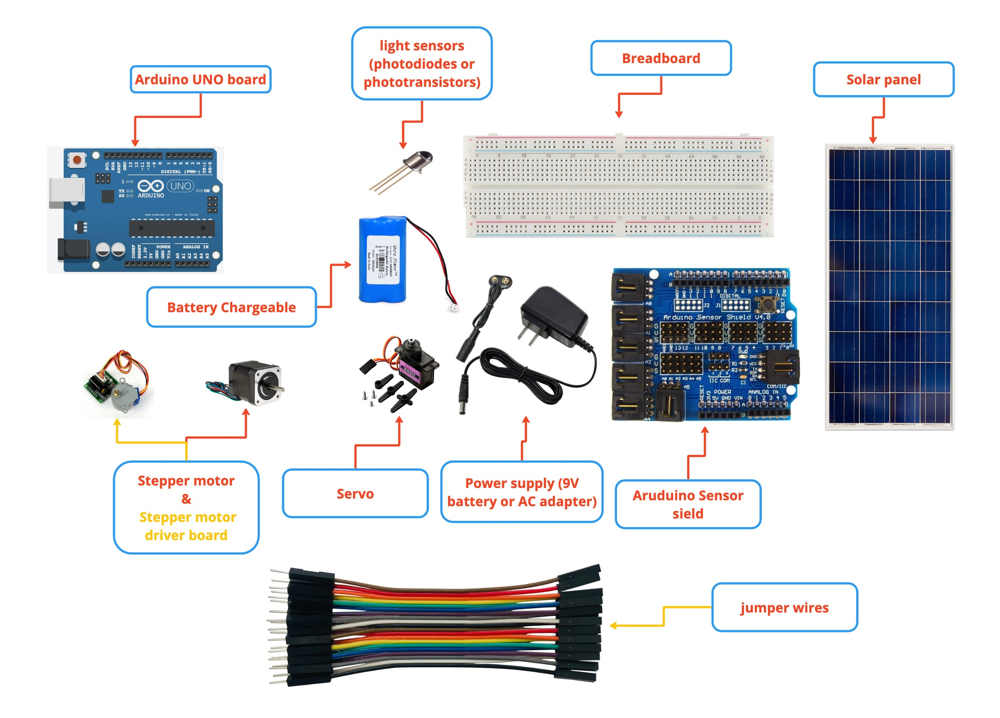

# arduino-solar-system-tracking

##  ***Solar System Hardware Requirement***
1.Arduino UNO board

2.Two light sensors (photodiodes or phototransistors)

3.Stepper motor || Servo

4.Stepper motor driver board

5.Solar panel

6.Breadboard and jumper wires

7.Power supply (9V battery or AC adapter)

8.Aruduino Sensor sield

10.Battery Chargeable

##  ***Solar System Software Requirement***

1.Arduino IDE (Integrated Development Environment)

2.Accurate time-keeping library (such as DS3231)

3.Stepper motor library (such as AccelStepper)

4.Light sensor library (if needed, depending on the sensor used)
Mechanical requirements:

1.A frame or structure to hold the solar panel and motor assembly

2.A mounting bracket to attach the motor to the frame or structure

3.A gear or pulley system to connect the motor to the solar panel for adjusting the angle

